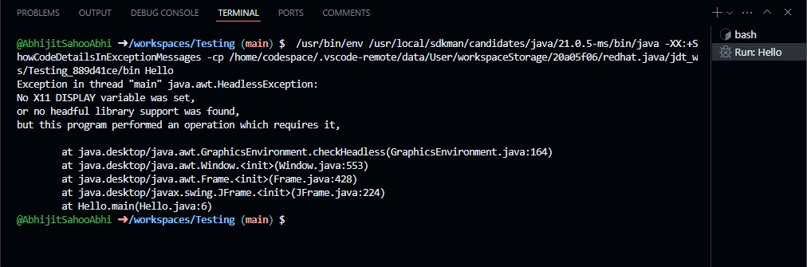

# Welcome to the Java Program

In this guide, you will learn whether a Java GUI can run in a CLI Linux environment. If it can, you'll find out how; if not, you'll understand why.

## First Attempt Output

